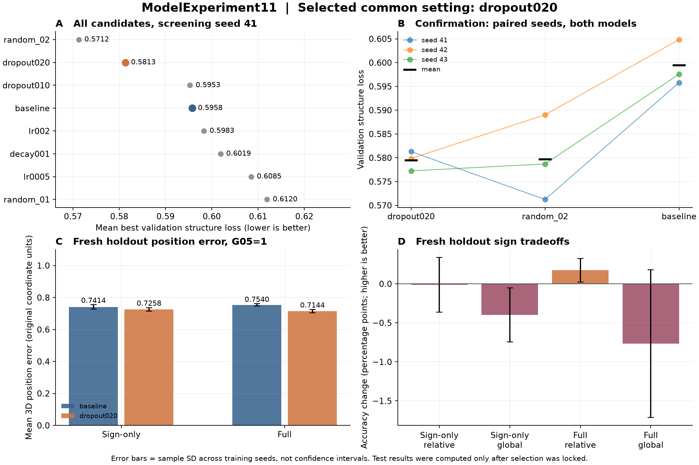
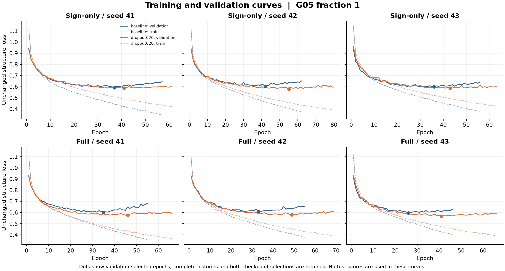

# ModelExperiment11 실제 튜닝 결과

**28회 학습과 최종 평가를 완료했다.** 선택된 공통 설정은 **learning rate 0.001, weight decay 0.0001, structure dropout 0.2**다. 기존 기준선과 비교하면 학습률·감쇠는 유지하고 구조 dropout만 0 → 0.2로 바뀐다.

두 모델·세 학습 seed의 평균 검증 구조 손실은 **0.599398 → 0.579470, 3.32% 감소**했다. 검증 결과로 설정과 checkpoint를 먼저 잠근 뒤, 기존 테스트 1,000개와 새 합성 홀드아웃 1,000개를 평가했다. 테스트를 보고 설정·seed·checkpoint 기준을 바꾸지 않았다.

[재현 명령과 전체 프로토콜](README.md) · [사전 분석](analysis.md) · [자동 생성 상세 보고서](studies/main/report.md)

## 선택 근거

기존 36개 정식 학습의 과적합과 14개 pilot의 정규화 반응을 분석한 뒤, 6개 사전 지정 후보와 2개 고정 난수 후보를 탐색했다. 두 모델에 같은 설정을 적용하고 데이터 분할·정규화·loss·batch size·최대 epoch·seed를 통제했다.

| 확인 단계 후보 | 평균 검증 구조 손실 | 학습 seed 간 표준편차 | 기준선 대비 개선 |
| --- | ---: | ---: | ---: |
| 선택: dropout 0.2 | **0.579470** | 0.002059 | **3.32%** |
| random_02: lr 약 0.00212 + dropout 0.2 | 0.579655 | 0.008931 | 3.29% |
| baseline: lr 0.001, decay 0.0001, dropout 0 | 0.599398 | 0.004792 | — |

두 상위 후보의 평균 차이는 약 0.000186으로 작다. 사전에 고정한 최저 평균 검증 손실 규칙에 따라 dropout 0.2를 선택했으며, 이 조합이 통계적으로 유일한 최적점이라고 주장하지 않는다. 표준편차는 설명용 지표이며 사후에 선택 규칙으로 추가하지 않았다.

선택 후보는 검증 구조 손실에서 full **4.56%**, sign-only **2.08%** 개선했고, 두 모델 모두 세 seed에서 개선했다. 모델별 평균 손실이 기준선보다 1% 넘게 악화되면 제외하는 사전 조건도 통과했다.

## 설정 확정 후의 최종 평가

아래는 일차 기준으로 정한 `best_structure.pt`의 세 seed 평균이다. 3D 오차는 정규화를 되돌린 프로젝트 좌표 단위의 전하별 거리 평균이며, 기존 120개 순열 공동 대응 지표를 유지했다.

| 평가 집합 | 모델 | 구조 손실: baseline → 선택 | 손실 감소 | 3D 위치 오차: baseline → 선택 | 오차 감소 |
| --- | --- | ---: | ---: | ---: | ---: |
| 새 홀드아웃 | Full | 0.593162 → 0.560248 | **5.55%** | 0.753956 → 0.714383 | **5.25%** |
| 새 홀드아웃 | Sign-only | 0.589209 → 0.576140 | **2.22%** | 0.741436 → 0.725827 | **2.11%** |
| 기존 테스트 | Full | 0.599775 → 0.578731 | 3.51% | 0.756561 → 0.721064 | 4.69% |
| 기존 테스트 | Sign-only | 0.594501 → 0.585041 | 1.59% | 0.749003 → 0.730890 | 2.42% |

새 홀드아웃의 3D 위치 오차는 두 모델 각각 3/3 seed에서 감소했다. 구조 손실은 full 3/3, sign-only 2/3 seed에서 감소했다. 기존 테스트셋은 과거 분석에서 사용된 적이 있으므로 새 독립 증거와 구분한다.

**모든 출력이 개선된 것은 아니다.** 새 홀드아웃에서 다음 상충관계가 있다.

- Full 전체부호 정확도: **87.13% → 86.37%, −0.77%p**.
- Full 절대부호 정확도: **88.81% → 87.95%, −0.86%p**; 세 seed 모두 하락.
- Sign-only 전체부호 정확도: **87.37% → 86.97%, −0.40%p**.
- Sign-only 전하 크기 MAE: **0.158663 → 0.160250, 약 1.00% 악화**.
- 상대부호 NLL/5는 full 약 6.05%, sign-only 약 5.16% 증가했다. NLL의 변화와 정답률의 변화는 같은 지표가 아니다.

선택 목적은 기존의 구조 복합 손실이다. 따라서 결과는 **위치 복원 중심의 개선과 일부 부호·크기 지표의 악화가 함께 있는 설정**으로 해석해야 한다. 전체부호 정확도가 최우선인 별도 목적에 대해 이 설정을 최적이라고 부르지 않는다.

Sign-only의 공통 epoch 구간에서 baseline과 dropout 후보의 train/validation 전체부호 손실은 세 seed 모두 정확히 같았다(최대 차이 0). 구조 dropout이 독립 전체부호 경로를 직접 바꾼 것은 아니며, 구조 기준으로 선택된 epoch가 달라 최종 부호 지표가 달라질 수 있다. [분기 비교 기록](studies/main/sign_only_branch_audit.json).



## 저장·재현·검증

총 **1,708 epoch**, 기록된 학습 실행 시간 합 **약 19.2분**, checkpoint **84개**를 저장했다. 시간 합은 각 trial이 기록한 학습·저장·검증 구간으로 전체 작업 시간이나 전용 장비의 성능 벤치마크를 뜻하지 않는다. 모든 trial은 공통 150-epoch 상한 이전에 같은 조기 종료 규칙으로 종료했다.

최종 평가 기록은 2개 설정 × 2개 모델 × 3개 seed × 2개 checkpoint 기준 × 2개 평가 집합 = **48개**다. 전체부호를 포함하는 `best_total.pt` 결과도 원래 기준 그대로 보관했고, 테스트 성적을 보고 일차 기준을 그쪽으로 바꾸지 않았다.

| 산출물 | 내용 |
| --- | --- |
| [실험 정의](studies/main/study.json) | 데이터·배열·소스 해시, 분할, 정규화, 환경, 후보와 선택 규칙 |
| [최종 선택 잠금](studies/main/selection.json) | 선택 이유·순위·설정·평가할 checkpoint의 SHA-256 |
| [전체 trial 기록](studies/main/trials.csv) | 후보별 설정·검증 성분·물리 지표·선택 epoch·종료 이유 |
| [seed별 대응 비교](studies/main/paired_comparisons.csv) | 동일 조건의 baseline 대 선택 후보 |
| [집계 비교](studies/main/comparison_summary.csv) | 평균·표준편차·개선 seed 수 |
| [routing 비교](studies/main/routing_comparisons.csv) | 동일 설정에서 full 대 sign-only의 기존 핵심 비교 |
| [최종 평가 원자료](studies/main/final/result.json) | 두 holdout의 전체 평가와 파일 해시 |
| [독립 검산](studies/main/independent_final_audit.json) | 예정 실행 완료, 순위·산식·최적 epoch·해시·시간 순서 재확인 |
| [소스와 가중치](studies/main) | `sources/` 스냅샷, `runs/*/latest.pt`와 두 best checkpoint |

원본 코드·문서·데이터·결과·가중치 **1,304개 파일의 내용이 보존됨**을 해시로 확인했다. [보존 검사](audit/preservation_check.json).

신규 통합 테스트 **13/13 통과**, 기존 테스트를 포함한 전체는 **145개 중 141개 통과·1개 오류·3개 skip**이다. 오류 1개는 수정 전에도 발생한 기존 Windows 긴 경로 저장 테스트이며, 신규 회귀 오류는 없었다. CPU/CUDA의 dropout 중단·재개 일치, v10 기준선 일치, 테스트 접근 차단, 설정/체크포인트 변경 거부, 완료 명령 재실행을 검사했다. [신규 테스트 로그](audit/pipeline_tests.log), [전체 테스트 로그](audit/all_tests_final.log).

```powershell
# 완료된 이 실험에서는 재학습/재평가 없이 기존 결과를 검증하고 반환
.\.venv\Scripts\python.exe Codes\ModelExperiment11.py run --device cuda

# 저장 원자료를 독립적으로 다시 검산
.\.venv\Scripts\python.exe Modelexperiment11\verify_results.py
```

다른 폴더에서 같은 실험을 새로 재현하는 명령과, 이미 본 테스트 seed를 새 독립 검증으로 재사용하지 않는 원칙은 [README](README.md)에 있다. 이번 증거의 범위는 **G05 100%, 하나의 train/validation 분할, 같은 합성 분포와 센서 좌표**다. 다른 관측 비율·새 센서 배치·잡음·실측 데이터까지 일반화하지 않는다.



드롭아웃 후보의 train 손실에는 무작위 mask가 켜지고 validation에서는 꺼진다. 따라서 두 곡선 사이의 간격만으로 개선을 판단하지 않았으며, 최적 검증 손실과 사후 holdout 평가를 따로 확인했다.
